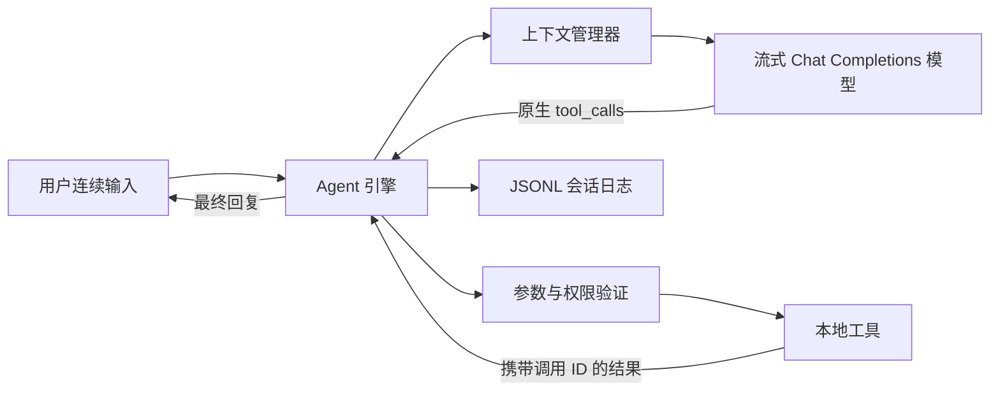

# LocalLoop

LocalLoop 是一个小型、可审计的交互式编程智能体。启动后，它会像常见的终端编程智能体一样保持一个持续会话：用户可以直接输入任务，逐字看到模型回答，观察每次本地操作的具体目标与结果，继续追问或修正要求，也可以通过斜杠命令切换模型、恢复历史会话和调整审批策略。

项目不使用任何 Agent 框架，也不依赖服务端托管的文件工具或代码执行工具。兼容 OpenAI 接口的 Python 客户端只负责发送 Chat Completions 请求；对话历史、上下文压缩、工具定义、本地调度、权限检查、错误重试、终止条件以及会话恢复均由本项目自行实现。



## 环境要求与安装

- Python 3.11 或更高版本
- macOS 或 Linux
- 一个兼容 OpenAI 接口且支持原生函数调用的模型

```bash
python3 -m venv .venv
source .venv/bin/activate
python -m pip install '.[dev]'
```

把示例复制为当前启动目录下的 `.env`，程序会自动读取，无需手动 `export`：

```bash
cp .env.example .env
# 编辑 .env，填写 LLM_API_KEY、LLM_BASE_URL、LLM_MODEL
```

真实 API 密钥不能出现在源码、文档、截图、视频或 Git 历史中；`.env` 已被 `.gitignore` 忽略，Agent 本身也不能读取该文件。若同时使用 `.env` 和已导出的同名环境变量，显式环境变量优先。之所以只读取“启动命令所在目录”的 `.env`，而不主动读取 `-C` 指定目标中的配置，是为了避免执行陌生项目时加载其不可信配置。

首次使用前运行诊断命令。设置 `LLM_MODEL` 后，完整诊断会发送两次很小的请求：第一次验证模型能否发起原生函数调用，第二次验证工具结果回填后能否继续生成最终文本。诊断使用与正常 Agent 相同的 `tool_choice=auto`，兼容不允许强制工具调用的思考模型：

```bash
localloop doctor --skip-tool-check
localloop doctor
```

## 交互式使用

进入需要处理的项目目录，直接运行：

```bash
localloop
```

也可以指定工作区，或使用显式的 `chat` 别名：

```bash
localloop -C /path/to/project
localloop chat --workspace /path/to/project
```

启动界面会显示当前模型、工作区和审批模式。直接输入编程任务即可；终端会流式显示正文，并把“读取哪个文件、搜索什么文本、写入多少字节、运行什么命令、退出码和输出摘要”等具体事实逐项展示。空闲时不会为命令菜单预留空白；只有输入 `/` 后，菜单才在输入框下方展开全部命令及说明，可用上下键选择、Tab 补全、Enter 执行，继续输入前缀会即时筛选。模型完成一轮后程序不会退出，可以继续追问，例如要求补充测试、解释设计或重新检查结果。输入历史保存在被 Git 忽略的 `.localloop/input_history` 中。

### 交互命令

| 命令 | 作用 |
| --- | --- |
| `/help` | 显示交互命令帮助 |
| `/status` | 显示模型、工作区、审批模式和当前会话 |
| `/new` | 清空当前上下文，下一条输入创建新会话 |
| `/resume ID` | 恢复指定会话，在窗口重绘历史对话后继续 |
| `/sessions` | 列出当前工作区最近十个会话 |
| `/delete ID` | 确认后删除指定会话；删除当前会话会同时清空当前上下文 |
| `/models` | 从兼容网关查询可用模型 |
| `/model ID` | 为当前交互进程切换模型 |
| `/approval ask` | 写文件和运行命令前逐次确认 |
| `/approval auto` | 自动批准写入和命令，仅限可信工作区 |
| `/clear` | 清屏并重新显示启动信息 |
| `/exit` | 退出程序；也可按 Ctrl-D |

程序会把同一交互进程中的后续普通输入追加到当前消息历史，因此模型能够看到上一轮的回复与工具结果。`/resume ID` 会恢复模型上下文，并把已保存的用户与助手消息重绘到当前窗口；输入 `/new` 会开始全新上下文但保留磁盘记录，`/delete ID` 才会删除指定历史会话。

## 非交互式使用

脚本、自动化测试或两分钟演示也可以继续使用单任务模式：

```bash
localloop run '找到失败的测试，在不修改公共 API 的前提下修复问题并运行测试。' \
  --workspace /path/to/project
```

中断后可以使用输出中的会话编号恢复：

```bash
localloop run --workspace /path/to/project --resume 12位会话编号
```

## 审批与安全边界

只读工具会直接执行。写文件前默认展示统一 diff，命令执行前展示完整 argv，并请求用户批准。在可信、可丢弃的演示工作区中，可以显式使用 `--auto-approve`，或在交互模式输入 `/approval auto`：

```bash
localloop --workspace /tmp/demo --auto-approve
```

自动批准不是操作系统沙箱。即使程序会限制路径、敏感文件、破坏性命令、子进程环境和运行时间，也不应在不可信仓库或包含不可恢复数据的机器上使用该模式。

## 本地实现的五个工具

| 工具 | 用途 | 主要保护机制 |
| --- | --- | --- |
| `list_files` | 查看受限范围内的目录树 | 忽略内部路径和敏感路径 |
| `read_file` | 读取最多 400 行 UTF-8 文本 | 大小与二进制检查；返回 SHA-256 |
| `search_text` | 搜索字面代码内容 | 优先使用 `rg`，并提供纯 Python 备用实现 |
| `write_file` | 创建或原子替换文本文件 | diff、用户批准、路径边界、陈旧写入哈希检查 |
| `run_command` | 执行测试和开发命令 | argv、无 Shell、用户批准、环境净化、超时限制 |

`run_command` 会阻止一组明显破坏性的命令和会改写历史的 Git 操作，并且只向子进程传递少量不含密钥的环境变量。

## 可靠性设计

- Assistant 发起的工具调用会被完整保留，每个执行结果都会作为 `tool` 消息返回，并携带与原调用匹配的 call ID。
- 参数错误、未知工具、命令失败和陈旧写入都会转换为结构化结果，使模型能够自行修正。
- 超时、限流、服务器错误或空响应最多进行两次指数退避重试，即单次模型调用最多发送三次请求；每次重试都会显示原因与等待时间，认证失败和无效请求立即终止。
- 流式分片会在本地重组为完整正文和工具调用参数；如果尚未收到有效分片，可以安全重试；如果已向终端输出部分正文后断流，则立即报错而不自动重试，避免重复显示或重复执行工具。
- HTTP 成功但正文为空、`choices` 为空、消息同时缺少文本和工具调用，均被识别为“空响应”；这通常指向兼容网关或上游模型，而不是本地工具代码。
- 每轮运行会在模型返回最终文本、达到步骤或时间限制、空响应重试耗尽、用户中断，或连续三次出现相同工具调用批次时停止。
- 完整事件保存在 `.localloop/sessions/*.jsonl`；旧上下文以完整工具交互组为单位进行确定性压缩，不需要第二次模型总结。
- 会话事件写入后会同步落盘；恢复时可忽略崩溃留下的最后一条未写完事件，并为缺失结果的尾部工具调用补入明确错误，保证消息协议仍然有效。
- `.localloop` 状态目录同样验证工作区边界并拒绝越界符号链接；目录权限收紧为 `0700`，会话和输入历史文件收紧为 `0600`。
- API 密钥不会进入对象表示、会话记录、工具提示词或子进程环境。

## 测试

默认测试套件使用脚本化 FakeProvider，不需要 API 密钥：

```bash
ruff check .
pytest --cov=localloop --cov-report=term-missing --cov-fail-under=85
python scripts/release_check.py
```

CI 会在 Python 3.11 和 3.12 上运行相同检查，并读取完整 Git 历史执行秘密与材料审计；真实 API 请求不会进入 CI。

## 已知限制

LocalLoop 目前仅处理 UTF-8 文本，也没有操作系统级沙箱。字符预算是一种与具体 Provider 无关的保守近似，不是精确的 tokenizer 统计；写文件采用完整文件替换而非补丁协议。交互界面保持模型会话，但每条用户任务仍通过一个有明确模型调用次数和总时间上限的 Agent 轮次完成。

## 实现结构

- `agent.py`：有界模型/工具循环与终止逻辑
- `interactive.py`：持续会话、终端界面与斜杠命令
- `cli.py`：默认交互入口、`doctor` 和兼容的 `run` 模式
- `provider.py`：接口传输、响应解析、重试和模型探测
- `tools.py`：工具 Schema、参数验证、本地执行与输出限制
- `context.py`：确定性上下文压缩
- `session.py`：带版本号、仅追加的 JSONL 会话记录

从零阅读顺序、考核逐条映射、重要设计决策、视频与答辩材料见 `docs/README.md`。
