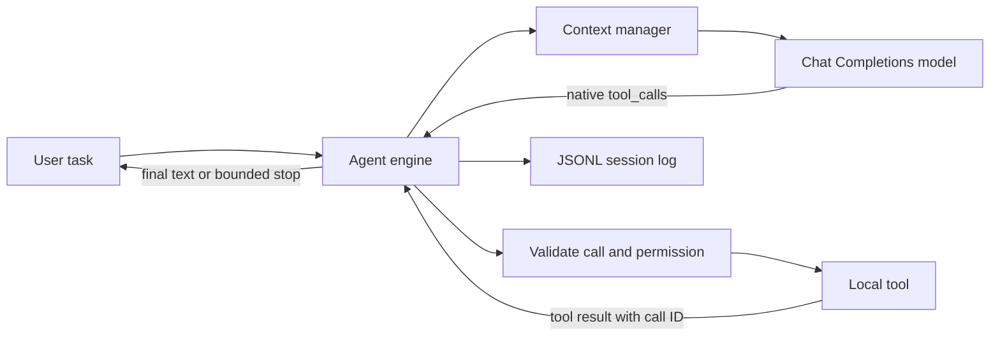

# LocalLoop

LocalLoop is a small, auditable coding agent. It asks an OpenAI-compatible model what to do, validates each native function call, executes the requested operation locally, returns the result to the model, and repeats until the task is complete or a safety limit is reached. It does not use an agent framework or any server-hosted file or code-execution tool.

## Why this project exists

The implementation keeps the important control flow visible: conversation history, context compaction, tool schemas, local dispatch, permission checks, retries, termination, and session recovery are ordinary Python modules that can be read and tested independently. The only model dependency is the official `openai` Python client used as transport for an OpenAI-compatible Chat Completions endpoint.



## Requirements and installation

- Python 3.11 or newer
- macOS or Linux
- An OpenAI-compatible model that supports native function calling

```bash
python3 -m venv .venv
source .venv/bin/activate
python -m pip install '.[dev]'
```

Create a fresh API key. Never paste a real key into source code, documentation, screenshots, videos, or committed configuration. Export it only in the local shell:

```bash
export LLM_API_KEY='newly-issued-key'
export LLM_BASE_URL='https://token.bayesdl.com/api/maas/v1'
export LLM_MODEL='model-id-from-doctor'
```

First list available models. After setting `LLM_MODEL`, the default doctor run also spends one small request to verify that the selected model returns a native function call:

```bash
localloop doctor --skip-tool-check
localloop doctor
```

Run a task in a target workspace:

```bash
localloop run 'Find the failing test, fix the bug without changing the public API, and run the tests.' --workspace /path/to/project
```

Read-only operations run immediately. File writes show a unified diff and commands show their argv before requesting approval. A disposable demonstration workspace can opt into autonomous execution explicitly:

```bash
localloop run 'Fix the failing tests.' --workspace /tmp/demo --auto-approve
```

If a run is interrupted, LocalLoop prints its session ID. Resume it without repeating the task:

```bash
localloop run --workspace /path/to/project --resume 12-character-id
```

## Locally implemented tools

| Tool | Purpose | Main guardrails |
| --- | --- | --- |
| `list_files` | Inspect a bounded directory tree | Omits internal and sensitive paths |
| `read_file` | Read up to 400 UTF-8 lines | Size/binary checks; returns SHA-256 |
| `search_text` | Literal code search | `rg` with a pure-Python fallback |
| `write_file` | Create or atomically replace text | Approval, diff, workspace boundary, stale-write hash |
| `run_command` | Execute tests and developer commands | Argv only, no shell, approval, sanitized environment, timeout |

`run_command` intentionally blocks a small set of destructive commands and state-changing Git operations. It passes only a narrow set of non-secret environment variables to children. These controls reduce accidents; they are not an operating-system sandbox. Do not use `--auto-approve` on an untrusted repository or a machine containing irreplaceable data.

## Reliability design

- Assistant tool calls are preserved exactly, and each result is returned as a `tool` message with the matching call ID.
- Malformed arguments, unknown tools, command failures, and stale writes become structured results so the model can correct itself.
- Timeouts, rate limits, and server failures retry at most three times with exponential backoff; authentication and invalid requests fail immediately.
- A run stops on final text, the configured step/time limit, an empty response, user interruption, or three identical consecutive tool-call batches.
- Full events remain in `.localloop/sessions/*.jsonl`. Old request context is compacted deterministically by replacing complete tool-interaction groups, so no second model is needed to invent a summary.
- API keys are excluded from object representations, session data, tool prompts, and child-process environments.

## Tests

The default suite is deterministic and uses a scripted fake provider, so it needs no API key:

```bash
ruff check .
pytest --cov=localloop --cov-report=term-missing --cov-fail-under=85
```

CI runs the same checks on Python 3.11 and 3.12. A live API request is deliberately not part of CI.

## Two-minute demonstration

The intentionally failing project under `demo/price_project` exercises reading, a guarded write, and test execution. Copy it so the checked-in fixture remains unchanged:

```bash
rm -rf /tmp/localloop-price-demo
cp -R demo/price_project /tmp/localloop-price-demo
cd /tmp/localloop-price-demo && pytest -q
cd -
localloop run 'Keep the public API unchanged. Find and fix the money precision and discount-threshold boundary bugs, add boundary tests, and run all tests.' --workspace /tmp/localloop-price-demo --auto-approve
```

The expected starting failures are part of the demo fixture and are excluded from this repository's normal test discovery. See `docs/VIDEO_SCRIPT.md`, `docs/ENGLISH_INTRO.md`, and `docs/DEFENSE.md` for presentation preparation.

## Known limitations

LocalLoop supports text files only, does not stream model output, has no OS-level sandbox, and expects a reasonably OpenAI-compatible Chat Completions implementation. Its character budget is a conservative, provider-independent approximation rather than an exact tokenizer count.

## Implementation map

- `agent.py`: bounded model/tool loop and termination
- `provider.py`: compatible transport, response parsing, retries, model probing
- `tools.py`: schemas, validation, local execution, and output limits
- `context.py`: deterministic context compaction
- `session.py`: versioned append-only JSONL history and resume
- `cli.py`: `doctor` and `run` user interface

## License

MIT
